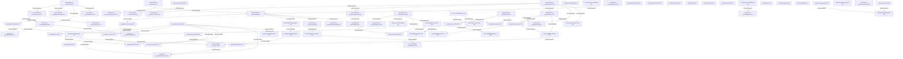

# AIP Mode 1 Learning Plan

## Scope

- Learning root: `AIP/`
- KP root: `AIP/preRaw/KP/`
- KP count: 74
- Status snapshot: 47 `pending`; 0 `learning`; 0 `review/persistence_pending`; 27 `completed`
- Learned and user-approved: 27 / 74
- Route objective: learn every prepared KP one at a time in a dependency-valid, conceptually useful order.
- Last analysis date: 2026-09-17
- Last progress update: 2026-10-05

## Knowledge Graph

The direction of every solid edge is prerequisite → dependent. All solid edges below are copied from KP frontmatter and are therefore hard prerequisites.

```mermaid
flowchart TD
  k001["aip-foundations-transformer-001"]
  k002["aip-foundations-modalities-002"]
  k003["aip-foundations-basemodels-003"]
  k004["aip-foundations-prompttechniques-004"]
  k005["aip-foundations-promptanatomy-005"]
  k006["aip-foundations-promptmanagement-006"]
  k007["aip-foundations-semanticsearch-007"]
  k008["aip-foundations-vectordimensionality-008"]
  k009["aip-foundations-vectortypes-009"]
  k010["aip-bedrock-finetuning-010"]
  k011["aip-bedrock-lora-011"]
  k012["aip-bedrock-continuedpretraining-012"]
  k013["aip-bedrock-customimport-013"]
  k014["aip-bedrock-knowledgebases-014"]
  k015["aip-bedrock-chunking-015"]
  k016["aip-bedrock-vectordatabases-016"]
  k017["aip-bedrock-reranking-017"]
  k018["aip-bedrock-contentfiltering-018"]
  k019["aip-bedrock-groundingcheck-019"]
  k020["aip-bedrock-reasoningpolicies-020"]
  k021["aip-agentic-planning-021"]
  k022["aip-agentic-actiongroups-022"]
  k023["aip-agentic-memory-023"]
  k024["aip-agentic-agentcore-024"]
  k025["aip-agentic-strands-025"]
  k026["aip-agentic-mcp-026"]
  k027["aip-agentic-qbusiness-027"]
  k028["aip-agentic-qdeveloper-028"]
  k029["aip-agentic-qapps-029"]
  k030["aip-data-bda-030"]
  k031["aip-data-textract-031"]
  k032["aip-data-transcribe-032"]
  k033["aip-data-comprehend-033"]
  k034["aip-data-glue-034"]
  k035["aip-data-wrangler-035"]
  k036["aip-data-appflow-036"]
  k037["aip-operations-tokenefficiency-037"]
  k038["aip-operations-modelrouting-038"]
  k039["aip-operations-crossregion-039"]
  k040["aip-operations-promptcaching-040"]
  k041["aip-operations-semanticcache-041"]
  k042["aip-operations-latency-042"]
  k043["aip-operations-backoff-043"]
  k044["aip-operations-circuitbreaker-044"]
  k045["aip-governance-evaluationtypes-045"]
  k046["aip-governance-evaluationmetrics-046"]
  k047["aip-governance-llmjudge-047"]
  k048["aip-security-iampolicies-048"]
  k049["aip-security-kmsencryption-049"]
  k050["aip-security-privateconnectivity-050"]
  k051["aip-security-macie-051"]
  k052["aip-governance-responsibleai-052"]
  k053["aip-governance-clarify-053"]
  k054["aip-governance-lineage-054"]

  k055["aip-integration-bedrockapi-055"]
  k056["aip-integration-streaming-056"]
  k057["aip-integration-eventdriven-057"]
  k058["aip-integration-apigateway-058"]
  k059["aip-integration-bedrockflows-059"]
  k060["aip-operations-provisionedthroughput-060"]
  k061["aip-sagemaker-deployment-061"]
  k062["aip-sagemaker-mlops-062"]
  k063["aip-security-promptinjection-063"]
  k064["aip-security-dataredaction-064"]
  k065["aip-security-appsecurity-065"]
  k066["aip-governance-audit-066"]
  k067["aip-observability-bedrock-067"]
  k068["aip-observability-agenttrace-068"]
  k069["aip-observability-modelmonitor-069"]
  k070["aip-testing-regression-070"]
  k071["aip-testing-ragtroubleshooting-071"]
  k072["aip-testing-agenttroubleshooting-072"]
  k073["aip-agentic-multiagent-hitl-073"]
  k074["aip-troubleshooting-context-074"]

  k001 -->|hard prerequisite| k003
  k002 -->|hard prerequisite| k003
  k005 -->|hard prerequisite| k004
  k005 -->|hard prerequisite| k006
  k009 -->|hard prerequisite| k007
  k009 -->|hard prerequisite| k008
  k003 -->|hard prerequisite| k010
  k010 -->|hard prerequisite| k011
  k001 -->|hard prerequisite| k012
  k003 -->|hard prerequisite| k013
  k007 -->|hard prerequisite| k014
  k009 -->|hard prerequisite| k014
  k009 -->|hard prerequisite| k016
  k007 -->|hard prerequisite| k017
  k014 -->|hard prerequisite| k019
  k021 -->|hard prerequisite| k022
  k021 -->|hard prerequisite| k023
  k021 -->|hard prerequisite| k024
  k023 -->|hard prerequisite| k024
  k021 -->|hard prerequisite| k025
  k022 -->|hard prerequisite| k025
  k022 -->|hard prerequisite| k026
  k005 -->|hard prerequisite| k037
  k003 -->|hard prerequisite| k038
  k038 -->|hard prerequisite| k039
  k005 -->|hard prerequisite| k040
  k037 -->|hard prerequisite| k040
  k007 -->|hard prerequisite| k041
  k037 -->|hard prerequisite| k042
  k043 -->|hard prerequisite| k044
  k045 -->|hard prerequisite| k046
  k045 -->|hard prerequisite| k047
  k052 -->|hard prerequisite| k053
  k045 -->|hard prerequisite| k053
  k055 -->|hard prerequisite| k056
  k042 -->|hard prerequisite| k056
  k055 -->|hard prerequisite| k057
  k055 -->|hard prerequisite| k058
  k006 -->|hard prerequisite| k059
  k003 -->|hard prerequisite| k060
  k013 -->|hard prerequisite| k061
  k061 -->|hard prerequisite| k062
  k054 -->|hard prerequisite| k062
  k018 -->|hard prerequisite| k063
  k033 -->|hard prerequisite| k064
  k051 -->|hard prerequisite| k064
  k048 -->|hard prerequisite| k065
  k048 -->|hard prerequisite| k066
  k052 -->|hard prerequisite| k066
  k042 -->|hard prerequisite| k067
  k037 -->|hard prerequisite| k067
  k022 -->|hard prerequisite| k068
  k067 -->|hard prerequisite| k068
  k061 -->|hard prerequisite| k069
  k045 -->|hard prerequisite| k070
  k046 -->|hard prerequisite| k070
  k014 -->|hard prerequisite| k071
  k017 -->|hard prerequisite| k071
  k046 -->|hard prerequisite| k071
  k021 -->|hard prerequisite| k072
  k022 -->|hard prerequisite| k072
  k068 -->|hard prerequisite| k072
  k021 -->|hard prerequisite| k073
  k005 -->|hard prerequisite| k074
  k037 -->|hard prerequisite| k074
```

## Relationship Notes

- `composition / recommended order`: `aip-bedrock-chunking-015` and `aip-bedrock-vectordatabases-016` explain important parts of the Knowledge Bases ingestion/retrieval path, but only vector types and semantic search are declared hard prerequisites of `aip-bedrock-knowledgebases-014`. Chunking remains a soft recommendation rather than an invented hard edge.
- `support`: `aip-data-bda-030` through `aip-data-appflow-036` supply or prepare data that may feed RAG, customization or analytics. They are mutually independent in current metadata and are grouped into one stage.
- `contrast`: `aip-bedrock-finetuning-010`, `aip-bedrock-continuedpretraining-012`, and `aip-bedrock-knowledgebases-014` solve different adaptation problems: learned behavior, domain pre-training, and externally refreshed knowledge.
- `composition`: agent planning, action groups, memory, AgentCore, Strands and MCP form an execution stack. Only the explicit frontmatter links are hard prerequisites; Q Business, Q Developer and Q Apps remain independent product-facing KPs.
- `shared mechanism`: semantic representations support both RAG retrieval and semantic caching, which is why `aip-foundations-semanticsearch-007` is a hard prerequisite of `aip-operations-semanticcache-041`.
- `causal feedback`: evaluation types, metrics and LLM judges produce evidence that can influence model choice, routing, prompt design and RAG tuning. These are supporting feedback relationships, not current hard prerequisites.
- `cross-cutting support`: IAM, KMS, PrivateLink and Macie constrain data preparation, training, inference, retrieval and agent tools. Their absence from most frontmatter dependencies is treated as a scope choice, not as proof that production systems can ignore security.
- `contrast`: content filtering, contextual grounding and automated reasoning answer different safety questions—allowed content, evidence support and policy consistency—and are not substitutes for one another.
- `independence`: all KPs grouped within a route stage have no hard-prerequisite path between one another. Their listed order is deterministic and recommended, not mandatory.

## Validation Findings

- 74 readable KP files are in scope; the 20 new gap-filling KPs (055–074) were validated against their declared IDs, scopes, sources and prerequisites, while the existing 54-KP graph and completed progress were preserved.
- The graph contains 65 hard prerequisite edges. Every referenced prerequisite exists.
- No dependency cycles or contradictory hard edges were found.
- No hard blocker prevents a complete sequential route.
- Ambiguous soft edges were not promoted to hard prerequisites: notably chunking → Knowledge Bases, data preparation → RAG, IAM/security → AWS service use, and evaluation → model routing.
- The route now covers 74 prepared KPs. KPs 055–074 specifically close previously identified engineering, deployment, security, observability, testing and troubleshooting gaps. This materially improves AIP-C01 coverage, but no finite KP set guarantees complete exam coverage.

## Learning Route

Every stage is dependency-valid. Members within a stage are mutually independent under the hard graph; learn them one by one in the listed order.

### Stage 1 — Core representations and instructions

1. `aip-foundations-transformer-001` — Transformer 预训练架构
2. `aip-foundations-modalities-002` — 基础模型的模态
3. `aip-foundations-promptanatomy-005` — 提示词的组成结构
4. `aip-foundations-vectortypes-009` — 稠密向量与稀疏向量

### Stage 2 — Model and retrieval foundations

1. `aip-foundations-basemodels-003` — 基础模型家族与选型
2. `aip-foundations-prompttechniques-004` — Zero-shot、Few-shot 与 Chain-of-Thought
3. `aip-foundations-promptmanagement-006` — Bedrock Prompt Management
4. `aip-foundations-semanticsearch-007` — 语义搜索与 K 近邻
5. `aip-foundations-vectordimensionality-008` — 向量维度与性能权衡
6. `aip-bedrock-continuedpretraining-012` — 持续预训练
7. `aip-bedrock-chunking-015` — RAG 文档分块策略
8. `aip-bedrock-vectordatabases-016` — RAG 向量数据库选型

### Stage 3 — Data intake and preparation

1. `aip-data-bda-030` — Bedrock Data Automation 多模态提取
2. `aip-data-textract-031` — Amazon Textract 文档 OCR
3. `aip-data-transcribe-032` — Amazon Transcribe 语音识别与毒性检测
4. `aip-data-comprehend-033` — Amazon Comprehend 文本分析
5. `aip-data-glue-034` — AWS Glue 数据管道基础
6. `aip-data-wrangler-035` — SageMaker Data Wrangler
7. `aip-data-appflow-036` — AWS AppFlow SaaS 数据集成

### Stage 4 — Bedrock adaptation, RAG and safety foundations

1. `aip-bedrock-finetuning-010` — 监督式微调
2. `aip-bedrock-customimport-013` — 从 SageMaker 导入自定义模型
3. `aip-bedrock-knowledgebases-014` — Bedrock Knowledge Bases 自动化 RAG
4. `aip-bedrock-reranking-017` — Rerank 模型与相关性改进
5. `aip-bedrock-contentfiltering-018` — Guardrails 内容过滤
6. `aip-bedrock-reasoningpolicies-020` — Automated Reasoning Policies

### Stage 5 — Deeper customization and grounding

1. `aip-bedrock-lora-011` — LoRA 低秩适配
2. `aip-bedrock-groundingcheck-019` — 上下文依据检查

### Stage 6 — Agent foundations and product surfaces

1. `aip-agentic-planning-021` — Bedrock Agent 规划模块
2. `aip-agentic-qbusiness-027` — Amazon Q Business
3. `aip-agentic-qdeveloper-028` — Amazon Q Developer
4. `aip-agentic-qapps-029` — Amazon Q Apps 无代码应用生成

### Stage 7 — Agent actions and state

1. `aip-agentic-actiongroups-022` — Bedrock Agent Action Groups
2. `aip-agentic-memory-023` — Agent 短期与长期记忆

### Stage 8 — Agent runtime, framework and protocol

1. `aip-agentic-agentcore-024` — AgentCore 的扩展与运行支撑
2. `aip-agentic-strands-025` — Strands SDK 代理开发框架
3. `aip-agentic-mcp-026` — Model Context Protocol 工具接口

### Stage 9 — Operational decision foundations

1. `aip-operations-tokenefficiency-037` — Token 效率与上下文裁剪
2. `aip-operations-modelrouting-038` — 静态与动态模型路由
3. `aip-operations-backoff-043` — 指数退避与抖动

### Stage 10 — Performance, capacity and resilience mechanisms

1. `aip-operations-crossregion-039` — Cross-Region Inference
2. `aip-operations-promptcaching-040` — Prompt Caching 与静态前缀
3. `aip-operations-semanticcache-041` — ElastiCache 语义缓存
4. `aip-operations-latency-042` — 延迟优化推理与 TTFT、OTPS
5. `aip-operations-circuitbreaker-044` — Step Functions 与 DynamoDB 熔断器

### Stage 11 — Evaluation, security and governance foundations

1. `aip-governance-evaluationtypes-045` — 自动评估与人工评估
2. `aip-security-iampolicies-048` — IAM Role 与资源策略
3. `aip-security-kmsencryption-049` — KMS 与静态、传输中加密边界
4. `aip-security-privateconnectivity-050` — VPC 与 PrivateLink 私有连接
5. `aip-security-macie-051` — Amazon Macie 敏感数据发现
6. `aip-governance-responsibleai-052` — Responsible AI 的公平、可解释与安全支柱
7. `aip-governance-lineage-054` — SageMaker Lineage Tracking 与 MLOps 审计

### Stage 12 — Evaluation and bias analysis

1. `aip-governance-evaluationmetrics-046` — ROUGE、BERTScore、Faithfulness 与 Correctness
2. `aip-governance-llmjudge-047` — LLM-as-a-Judge
3. `aip-governance-clarify-053` — SageMaker Clarify 偏差检测

### Stage 13 — Professional engineering gap coverage

1. `aip-integration-bedrockapi-055` — Bedrock API surfaces 与运行时调用
2. `aip-integration-bedrockflows-059` — Bedrock Flows 工作流编排
3. `aip-operations-provisionedthroughput-060` — Bedrock Provisioned Throughput 与容量规划
4. `aip-sagemaker-deployment-061` — SageMaker 实时 Endpoint 与 Batch Transform
5. `aip-security-promptinjection-063` — Prompt Injection、Jailbreak 与输入防护
6. `aip-security-dataredaction-064` — PII 检测、Token-level Redaction 与数据最小化
7. `aip-security-appsecurity-065` — Secrets Manager、Cognito 与 WAF 的应用安全角色
8. `aip-governance-audit-066` — CloudTrail、审计日志与数据保留
9. `aip-observability-bedrock-067` — Bedrock CloudWatch 指标、Invocation Logging 与 Dashboard
10. `aip-testing-regression-070` — Golden Dataset、回归测试、Canary 与 A/B 验证
11. `aip-testing-ragtroubleshooting-071` — RAG 评估与检索故障定位
12. `aip-agentic-multiagent-hitl-073` — Multi-agent Workflow 与 Human-in-the-Loop
13. `aip-troubleshooting-context-074` — Context Window、截断与 Prompt 回归排障

### Stage 14 — Integration, MLOps and deep observability

1. `aip-integration-streaming-056` — 流式推理与响应式客户端
2. `aip-integration-eventdriven-057` — 异步与事件驱动 GenAI 集成
3. `aip-integration-apigateway-058` — API Gateway 作为 GenAI 安全前门
4. `aip-sagemaker-mlops-062` — 模型部署防护、Registry、Pipelines 与回滚
5. `aip-observability-agenttrace-068` — Agent Tracing、X-Ray 与工具调用可观测性
6. `aip-observability-modelmonitor-069` — SageMaker Model Monitor 与数据/质量漂移

### Stage 15 — Agent validation and troubleshooting

1. `aip-testing-agenttroubleshooting-072` — Agent 评估与故障定位

### Deterministic one-by-one order

`001 → 002 → 005 → 009 → 003 → 004 → 006 → 007 → 008 → 012 → 015 → 016 → 030 → 031 → 032 → 033 → 034 → 035 → 036 → 010 → 013 → 014 → 017 → 018 → 020 → 011 → 019 → 021 → 027 → 028 → 029 → 022 → 023 → 024 → 025 → 026 → 037 → 038 → 043 → 039 → 040 → 041 → 042 → 044 → 045 → 048 → 049 → 050 → 051 → 052 → 054 → 046 → 047 → 053 → 055 → 059 → 060 → 061 → 063 → 064 → 065 → 066 → 067 → 070 → 071 → 073 → 074 → 056 → 057 → 058 → 062 → 068 → 069 → 072`

## Learning Progress

- [x] `aip-foundations-transformer-001` — Transformer 预训练架构
- [x] `aip-foundations-modalities-002` — 基础模型的模态
- [x] `aip-foundations-promptanatomy-005` — 提示词的组成结构
- [x] `aip-foundations-vectortypes-009` — 稠密向量与稀疏向量
- [x] `aip-foundations-basemodels-003` — 基础模型家族与选型
- [x] `aip-foundations-prompttechniques-004` — Zero-shot、Few-shot 与 Chain-of-Thought
- [x] `aip-foundations-promptmanagement-006` — Bedrock Prompt Management
- [x] `aip-foundations-semanticsearch-007` — 语义搜索与 K 近邻
- [x] `aip-foundations-vectordimensionality-008` — 向量维度与性能权衡
- [x] `aip-bedrock-continuedpretraining-012` — 持续预训练
- [x] `aip-bedrock-chunking-015` — RAG 文档分块策略
- [x] `aip-bedrock-vectordatabases-016` — RAG 向量数据库选型
- [x] `aip-data-bda-030` — Bedrock Data Automation 多模态提取
- [x] `aip-data-textract-031` — Amazon Textract 文档 OCR
- [x] `aip-data-transcribe-032` — Amazon Transcribe 语音识别与毒性检测
- [x] `aip-data-comprehend-033` — Amazon Comprehend 文本分析
- [x] `aip-data-glue-034` — AWS Glue 数据管道基础
- [x] `aip-data-wrangler-035` — SageMaker Data Wrangler
- [x] `aip-data-appflow-036` — AWS AppFlow SaaS 数据集成
- [x] `aip-bedrock-finetuning-010` — 监督式微调
- [x] `aip-bedrock-customimport-013` — 从 SageMaker 导入自定义模型
- [x] `aip-bedrock-knowledgebases-014` — Bedrock Knowledge Bases 自动化 RAG
- [x] `aip-bedrock-reranking-017` — Rerank 模型与相关性改进
- [x] `aip-bedrock-contentfiltering-018` — Guardrails 内容过滤
- [x] `aip-bedrock-reasoningpolicies-020` — Automated Reasoning Policies
- [x] `aip-bedrock-lora-011` — LoRA 低秩适配
- [x] `aip-bedrock-groundingcheck-019` — 上下文依据检查
- [ ] `aip-agentic-planning-021` — Bedrock Agent 规划模块
- [ ] `aip-agentic-qbusiness-027` — Amazon Q Business
- [ ] `aip-agentic-qdeveloper-028` — Amazon Q Developer
- [ ] `aip-agentic-qapps-029` — Amazon Q Apps 无代码应用生成
- [ ] `aip-agentic-actiongroups-022` — Bedrock Agent Action Groups
- [ ] `aip-agentic-memory-023` — Agent 短期与长期记忆
- [ ] `aip-agentic-agentcore-024` — AgentCore 的扩展与运行支撑
- [ ] `aip-agentic-strands-025` — Strands SDK 代理开发框架
- [ ] `aip-agentic-mcp-026` — Model Context Protocol 工具接口
- [ ] `aip-operations-tokenefficiency-037` — Token 效率与上下文裁剪
- [ ] `aip-operations-modelrouting-038` — 静态与动态模型路由
- [ ] `aip-operations-backoff-043` — 指数退避与抖动
- [ ] `aip-operations-crossregion-039` — Cross-Region Inference
- [ ] `aip-operations-promptcaching-040` — Prompt Caching 与静态前缀
- [ ] `aip-operations-semanticcache-041` — ElastiCache 语义缓存
- [ ] `aip-operations-latency-042` — 延迟优化推理与 TTFT、OTPS
- [ ] `aip-operations-circuitbreaker-044` — Step Functions 与 DynamoDB 熔断器
- [ ] `aip-governance-evaluationtypes-045` — 自动评估与人工评估
- [ ] `aip-security-iampolicies-048` — IAM Role 与资源策略
- [ ] `aip-security-kmsencryption-049` — KMS 与静态、传输中加密边界
- [ ] `aip-security-privateconnectivity-050` — VPC 与 PrivateLink 私有连接
- [ ] `aip-security-macie-051` — Amazon Macie 敏感数据发现
- [ ] `aip-governance-responsibleai-052` — Responsible AI 的公平、可解释与安全支柱
- [ ] `aip-governance-lineage-054` — SageMaker Lineage Tracking 与 MLOps 审计
- [ ] `aip-governance-evaluationmetrics-046` — ROUGE、BERTScore、Faithfulness 与 Correctness
- [ ] `aip-governance-llmjudge-047` — LLM-as-a-Judge
- [ ] `aip-governance-clarify-053` — SageMaker Clarify 偏差检测

- [ ] `aip-integration-bedrockapi-055` — Bedrock API surfaces 与运行时调用
- [ ] `aip-integration-bedrockflows-059` — Bedrock Flows 工作流编排
- [ ] `aip-operations-provisionedthroughput-060` — Bedrock Provisioned Throughput 与容量规划
- [ ] `aip-sagemaker-deployment-061` — SageMaker 实时 Endpoint 与 Batch Transform
- [ ] `aip-security-promptinjection-063` — Prompt Injection、Jailbreak 与输入防护
- [ ] `aip-security-dataredaction-064` — PII 检测、Token-level Redaction 与数据最小化
- [ ] `aip-security-appsecurity-065` — Secrets Manager、Cognito 与 WAF 的应用安全角色
- [ ] `aip-governance-audit-066` — CloudTrail、审计日志与数据保留
- [ ] `aip-observability-bedrock-067` — Bedrock CloudWatch 指标、Invocation Logging 与 Dashboard
- [ ] `aip-testing-regression-070` — Golden Dataset、回归测试、Canary 与 A/B 验证
- [ ] `aip-testing-ragtroubleshooting-071` — RAG 评估与检索故障定位
- [ ] `aip-agentic-multiagent-hitl-073` — Multi-agent Workflow 与 Human-in-the-Loop
- [ ] `aip-troubleshooting-context-074` — Context Window、截断与 Prompt 回归排障
- [ ] `aip-integration-streaming-056` — 流式推理与响应式客户端
- [ ] `aip-integration-eventdriven-057` — 异步与事件驱动 GenAI 集成
- [ ] `aip-integration-apigateway-058` — API Gateway 作为 GenAI 安全前门
- [ ] `aip-sagemaker-mlops-062` — 模型部署防护、Registry、Pipelines 与回滚
- [ ] `aip-observability-agenttrace-068` — Agent Tracing、X-Ray 与工具调用可观测性
- [ ] `aip-observability-modelmonitor-069` — SageMaker Model Monitor 与数据/质量漂移
- [ ] `aip-testing-agenttroubleshooting-072` — Agent 评估与故障定位

## Current Position

- Persistence root: GitHub `luyi985/aws/AIP`
- Completed and persisted: 27 / 74
- Remaining: 47 / 74
- Current KP state: `aip-bedrock-groundingcheck-019` — learning, review, user approval, and GitHub persistence complete.
- Next learning KP: `aip-agentic-planning-021` — Bedrock Agent 规划模块
- Blocker: None.
- Google Drive AIP content is a manual mirror; it is not required for completion.
